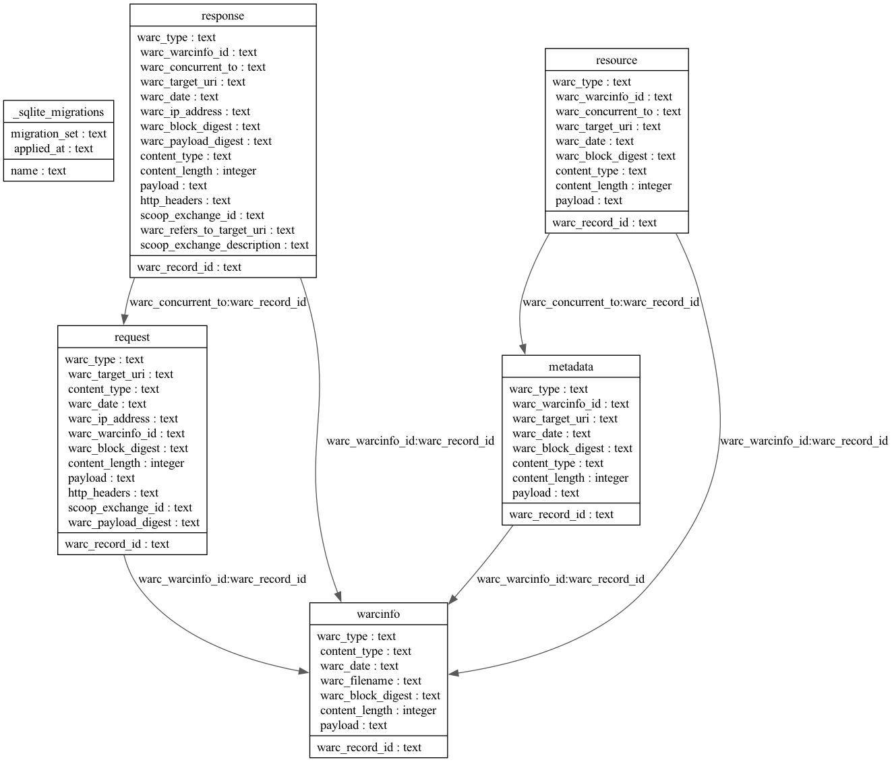

# WarcDB: Web crawl data as SQLite databases.

[](https://pypi.org/project/warcdb/)
[](https://github.com/Florents-Tselai/WarcDB/actions/workflows/run-tests.yaml)
[](https://github.com/Florents-Tselai/WarcDB/blob/main/LICENSE)
[

`WarcDB` is an `SQLite`-based file format that makes web crawl data easier to share and query.

It is based on the standardized [Web ARChive format](https://en.wikipedia.org/wiki/Web_ARChive),
used by web archives, and defined in [ISO 28500:2017](https://iipc.github.io/warc-specifications/specifications/warc-format/warc-1.1/).

## Usage

```shell
pip install warcdb
```

```shell
# Load the `archive.warcdb` file with data.
warcdb import archive.warcdb ./tests/google.warc ./tests/frontpages.warc.gz "https://tselai.com/data/google.warc"

warcdb enable-fts ./archive.warcdb response payload

# Search for records that mention "stocks" in their response body
warcdb search ./archive.warcdb response "stocks" -c "WARC-Record-ID"
```
As you can see you can use any mix of local/remote and raw/compressed archives.

For example to get a part of the [Common Crawl January 2022 Crawl Archive ](https://data.commoncrawl.org/crawl-data/CC-MAIN-2022-05/index.html) in a streaming fashion:

```shell
warcdb import archive.warcdb "https://data.commoncrawl.org/crawl-data/CC-MAIN-2022-05/segments/1642320306346.64/warc/CC-MAIN-20220128212503-20220129002503-00719.warc.gz
```

You can also import WARC files contained in [WACZ](https://specs.webrecorder.net/wacz/latest) files, that are created by tools like [ArchiveWeb.Page](https://archiveweb.page), [Browsertrix-Crawler](https://github.com/webrecorder/browsertrix-crawler), and [Scoop](https://github.com/harvard-lil/scoop).

```shell
warcdb import archive.warcdb tests/scoop.wacz
```

## How It Works

Individual `.warc` files are read and parsed and their data is inserted into an SQLite database with the relational schema seen below.

## Schema

If there is a new major or minor version of warcdb you may need to migrate existing databases to use the new database schema (if there have been any changes). To do this you first upgrade warcdb, and then import into the database, which will make sure all migrations have been run. If you want to migrate the database explicitly you can:

```shell
warcdb migrate archive.warcdb
```

If there are no migrations to run the `migrate` command will do nothing.

Here's the relational schema of the `.warcdb` file.



### Views

In addition to the core tables that map to the WARC record types there are also helper *views* that make it a bit easier to query data:

#### v_request_http_header

A view of HTTP headers in WARC request records:

| Column Name    | Column Type | Description                                                              |
| -------------- | ----------- | ----------------------------------------------------------------------   |
| warc_record_id | text        | The WARC-Record-Id for the *request* record that it was extracted from.  |
| name           | text        | The lowercased HTTP header name (e.g. content-type)                      |
| value          | text        | The HTTP header value (e.g. text/html)                                   |

#### v_response_http_header

A view of HTTP headers in WARC response records:

| Column Name    | Column Type | Description                                                              |
| -------------- | ----------- | ----------------------------------------------------------------------   |
| warc_record_id | text        | The WARC-Record-Id for the *response* record that it was extracted from. |
| name           | text        | The lowercased HTTP header name (e.g. content-type)                      |
| value          | text        | The HTTP header value (e.g. text/html)                                   |

## Motivation

From the `WARC` [formal specification](https://iipc.github.io/warc-specifications/specifications/warc-format/warc-1.1/):

> The WARC (Web ARChive) file format offers a convention for concatenating multiple resource records (data objects),
> each consisting of a set of simple text headers and an arbitrary data block into one long file.

Many organizations such as Commoncrawl, WebRecorder, Archive.org and libraries around the world, use the `warc` format
to archive and store web data.

The full datasets of these services range in the few pebibytes(PiB),
making them impractical to query using non-distributed systems.

This project aims to make **subsets** such data easier to access and query using SQL.

Currently, this is implemented on top of SQLite and is a wrapper around the
excellent [SQLite-Utils](https://sqlite-utils.datasette.io/en/stable/) utility.

`"wrapper"` means that all
existing `sqlite-utils` [CLI commands](https://sqlite-utils.datasette.io/en/stable/cli-reference.html)
can be called as expected like

```shell
sqlite-utils <command> archive.warcdb`
```
or
```shell
warcdb <command> example.warcdb
```

## Examples

### Populate with `wget`

```shell
wget --warc-file tselai "https://tselai.com"

warcdb import archive.warcdb tselai.warc.gz
```

### Get all response headers

```shell
sqlite3 archive.warcdb <<SQL
select  json_extract(h.value, '$.header') as header, 
        json_extract(h.value, '$.value') as value
from response,
     json_each(http_headers) h
SQL
```

### Get Cookie Headers for requests and responses
```shell
sqlite3 archive.warcdb <<SQL
select json_extract(h.value, '$.header') as header, json_extract(h.value, '$.value') as value
from response,
     json_each(http_headers) h
where json_extract(h.value, '$.header') like '%Cookie%'
union
select json_extract(h.value, '$.header') as header, json_extract(h.value, '$.value') as value
from request,
     json_each(http_headers) h
where json_extract(h.value, '$.header') like '%Cookie%'
SQL
```

## Develop

You can use poetry to install dependencies and run the tests:

```
$ git clone https://github.com/Florents-Tselai/WarcDB.git
$ cd WarcDB
$ poetry install
$ poetry run pytest
```

Then when you are ready to publish to PyPI:

```
$ poetry publish --build
```

Resources on WARC
----------------

* [The stack: An introduction to the WARC file](https://archive-it.org/blog/post/the-stack-warc-file/)

